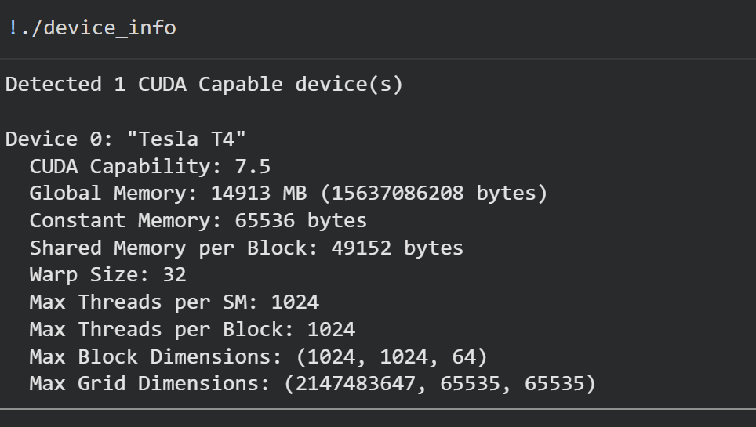

# My Lab Report: Introduction to CUDA (LAB 6)

---

## Part A: Device Query Report

**What I did:**  
I wrote a CUDA program (`device_info.cu`) to check the GPU details using CUDA runtime APIs. This helped me understand the hardware I’m working on and answer theoretical questions based on actual values.

### What the program shows:
- Device name and compute capability  
- Global, shared, and constant memory  
- Warp size  
- Maximum threads per block  
- Maximum block and grid dimensions  

### Key points:
- Warp size is 32 → threads execute in groups of 32  
- Maximum threads per block is 1024  
- Shared memory is fast but limited (used within a block)  
- Global memory is large but slower  

---

## Part B: Array Sum (Parallel Reduction)

**What I did:**  
I implemented `array_sum.cu` to sum 1,000,000 elements using a parallel reduction approach with shared memory. I also measured execution time for different thread block sizes.

### How it works:
- Each block loads data into shared memory  
- Parallel reduction is performed within the block  
- Final sum is computed on CPU  
- Execution time is measured using CUDA events  

### Output format (CSV):

### Block sizes tested:
 32, 64, 128, 256, 512, 1024

 

### Observations:
- Best performance around 64–128 threads  
- Very small blocks → poor GPU utilization  
- Very large blocks → resource contention  

### Takeaway:
Choosing the right block size is important — maximum threads do not always give best performance.

---

## Part C: Matrix Addition

**What I did:**  
I wrote `matrix_add.cu` to perform element-wise addition of two 4096 × 4096 matrices using a 2D grid and block structure.

### How it works:
- Each thread computes one element of the matrix  
- 2D blocks and grids are used  
- Execution time is measured using CUDA events  
- Output is printed in CSV format  

### Output format (CSV):

### Block sizes tested: 
2, 4, 8, 16, 32 (NxN blocks)

---

## Operations Analysis (4096 × 4096 Matrix)

- Total elements = 4096 × 4096 = **16,777,216**

**Operations:**
- Additions → 16,777,216  
- Global reads → 33,554,432  
- Global writes → 16,777,216  

---

## Observations:

- 2×2 block (4 threads) → very slow (warp underutilization)  
- 8×8 (64 threads) → good performance  
- 16×16 (256 threads) → optimal  
- 32×32 (1024 threads) → slightly slower due to resource limits  

---

## Final Conclusion

- GPU performance depends heavily on block and thread configuration  
- Maximum threads per block is not always optimal  
- Best performance is achieved when:
  - Threads align with warp size (multiples of 32)  
  - Resources like shared memory and registers are used efficiently  

---

## Tools Used

- CUDA C++  
- NVIDIA GPU (Local / Google Colab)  
- nvcc compiler  
- Python (Matplotlib) for plotting graphs  
