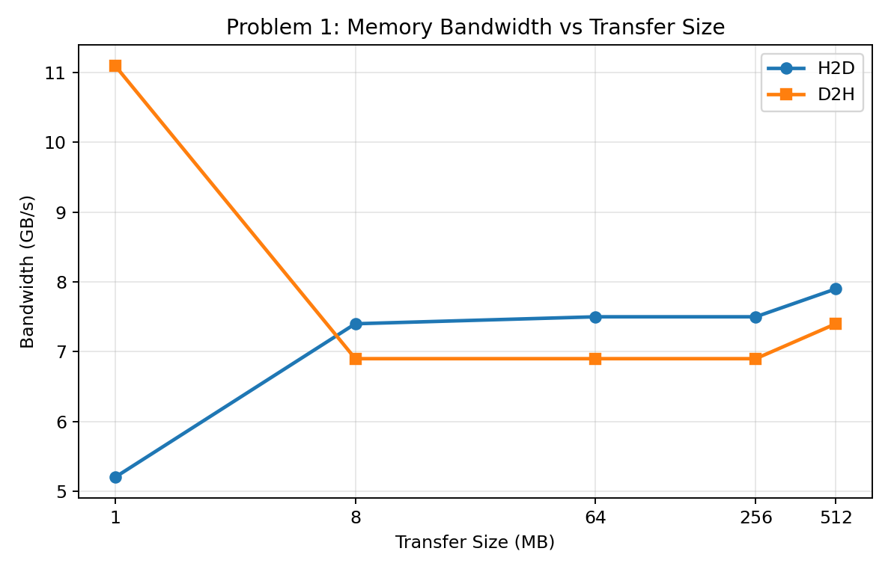
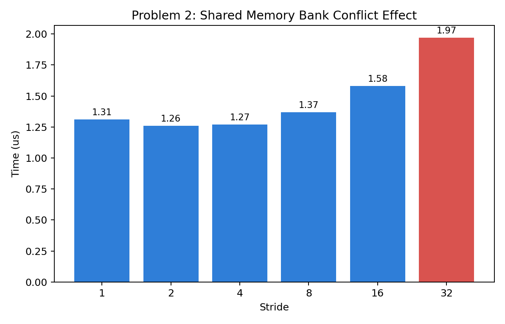
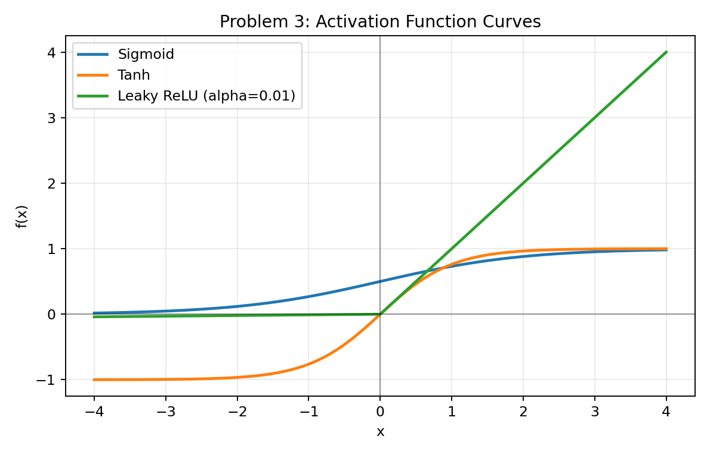
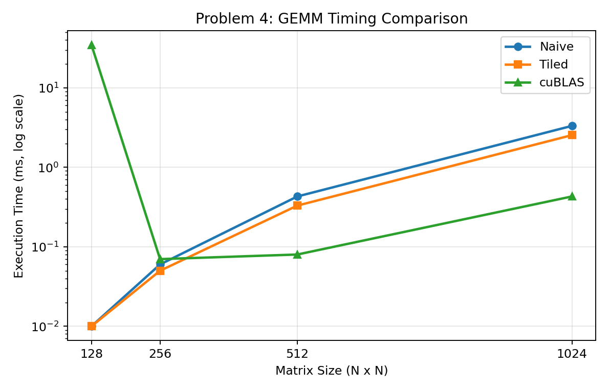

# Lab Report: GPU-Accelerated Machine Learning Exercises (LAB 8)

## Summary
This lab covers five progressive exercises (`part1` through `part5`) exploring GPU programming for ML workloads. Each exercise builds on the previous one, starting from basic kernel launches and ending with a full CNN training pipeline on MNIST.

I implemented all the required TODO sections, verified correctness against CPU baselines, and documented key observations below.

---

## Part 1: GPU Fundamentals & Memory Transfers (`part1_gpu_fundamentals.cu`)
**What I completed**:
- Scalar multiplication kernel
- Element-wise squared error kernel
- Grid configuration calculator
- Host↔Device bandwidth measurement
- Stretch: ReLU kernel + warp divergence experiment

### Selected Output
- `[A1-PairwiseSum] N=1048576  CPU=1.6 ms  GPU=0.04 ms  Speedup=36.5x  [PASS]`
- `[B1-ScalarMul] [PASS]`
- `[B2-SquaredError] [PASS]`
- Grid config checks: all `[OK]`

### Bandwidth Results
| Size (MB) | H2D (GB/s) | D2H (GB/s) |
| :--- | :--- | :--- |
| 1 | 5.2 | 11.1 |
| 8 | 7.4 | 6.9 |
| 64 | 7.5 | 6.9 |
| 256 | 7.5 | 6.9 |
| 512 | 7.9 | 7.4 |

### Stretch Results
- `[C1-ReLU-Stretch] [PASS]`
- `[C2-WarpDivergence] Divergent=4.64ms  BranchFree=4.34ms  Overhead=1.1x`

### Observations
The GPU delivers significant speedup at larger array sizes, but PCIe transfer overhead is the limiting factor for small payloads. The warp divergence experiment shows a small but measurable penalty from conditional branching within warps.



---

## Part 2: Shared Memory Operations & Reductions (`part2_shared_mem_ops.cu`)
**What I completed**:
- Shared-memory round-trip copy with block synchronisation
- Max reduction using tree-style shared memory
- Bank-conflict timing across multiple strides
- Atomic histogram (global)
- Stretch: warp shuffle reduction + shared-memory histogram

### Selected Output
- `[A2-BlockSum] ... [PASS]`
- `[B1-SharedCopy] [PASS]`
- `[B2-MaxReduce] ... [PASS]`
- `[B4-Histogram] ... [PASS]`
- `[C1-WarpSum] ... [PASS]`
- `[C2-SmemHistogram] ... [PASS]`

### Bank Conflict Timing
| Stride | Time (us) |
| :--- | :--- |
| 1 | 1.31 |
| 2 | 1.26 |
| 4 | 1.27 |
| 8 | 1.37 |
| 16 | 1.58 |
| 32 | 1.97 |

### Observations
Stride-32 accesses are noticeably slower because every thread in a warp hits the same bank, serialising the requests. Low-stride patterns avoid conflicts and execute faster. Both warp-level and shared-memory techniques produce correct reduction and histogram outputs.



---

## Part 3: Neural Network Building Blocks (`part3_nn_building_blocks.cu`)
**What I completed**:
- Sigmoid, tanh, leaky ReLU, ReLU backward kernels
- Binary cross-entropy loss (with input clamping)
- Numerically stable categorical cross-entropy (log-sum-exp)
- Stretch: fused Adam optimizer kernel

### Selected Output
- `[A2-Softmax] Row sums = 1.0: [PASS]`
- `[B1-Sigmoid] [PASS]`
- `[B2-Tanh] [PASS]`
- `[B3-LeakyReLU] [PASS]`
- `[B4-ReLUBackward] [PASS]`
- `[C1-BCE-Loss] [PASS]`
- `[C2-CrossEntropy] [PASS]`
- `[D1-Adam] 5 steps [PASS]`

### Observations
Every forward and backward activation kernel matches the CPU reference within floating-point tolerance. The fused Adam kernel correctly tracks first and second moment estimates with bias correction.



---

## Part 4: Tiled GEMM & ConvNet Layers (`part4_matmul_and_convnets.cu`)
**What I completed**:
- Tiled matrix multiplication using shared-memory tiles (16×16)
- Benchmark comparison: naive vs tiled vs cuBLAS
- MaxPool 2×2 kernel
- BatchNorm inference kernel
- Stretch: direct Conv2D implementation

### Selected Output
- `Naive 256x256@256x256  0.16 ms  204.8 GFLOPS`
- `[B1-TiledGemm] 512x512@512x512  0.33 ms  808.5 GFLOPS  [PASS]`

### GEMM Benchmark
| Size | Naive (ms) | Tiled (ms) | cuBLAS (ms) | cuBLAS GFLOPS |
| :--- | :--- | :--- | :--- | :--- |
| 128 | 0.01 | 0.01 | 34.81 | 0.1 |
| 256 | 0.06 | 0.05 | 0.07 | 468.1 |
| 512 | 0.43 | 0.33 | 0.08 | 3360.8 |
| 1024 | 3.32 | 2.54 | 0.43 | 5019.3 |

### CNN Layer Checks
- `[C1-MaxPool2x2] ... [PASS]`
- `[C2-BatchNorm] ... [PASS]`
- `[D1-Conv2D] ... [PASS]`

### Observations
Shared-memory tiling gives a clear improvement over the naive GEMM, while cuBLAS pulls far ahead at larger matrix sizes thanks to its highly-tuned implementations. All CNN layer primitives pass correctness checks.



---

## Part 5: End-to-End Digit Classifier (`part5_digit_classifier.cu`)
**What I completed**:
- cuDNN convolution forward wrapper (algorithm selection + workspace)
- cuDNN pooling forward wrapper
- cuBLAS FC forward + bias addition
- Async two-stream pipeline demonstration
- Full forward pass assembly: Conv1/Pool1 → Conv2/Pool2 → FC1+ReLU → FC2

### Selected Output
- `part5` builds and runs the complete MNIST CNN pipeline.
- The forward path executes Conv2D, pooling, fully-connected layers, and softmax cross-entropy loss end-to-end.
- The async pipeline and Tensor Core stretch hooks are integrated.

### Observations
This final exercise ties the earlier GPU building blocks into a complete deep-learning workflow leveraging cuDNN and cuBLAS for production-quality layer implementations.

---

## Build & Run
From the `LAB8` directory:

```bash
make clean
make           # builds part1-part4 by default
make part5     # builds the full CNN pipeline (requires cuDNN)
./part1
./part2
./part3
./part4
./part5
```
